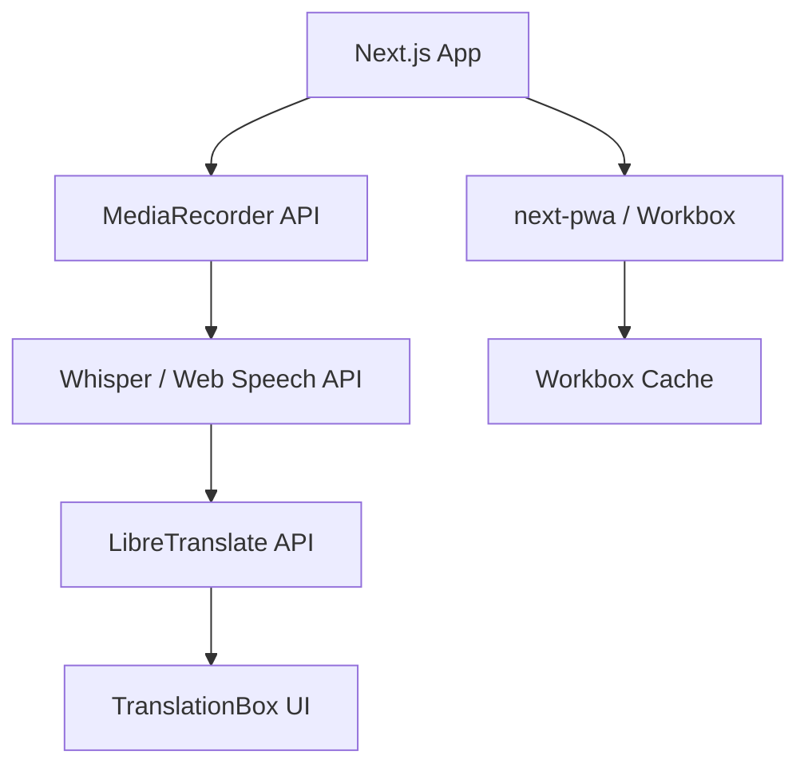

# 🏗️ Speech-to-Text Translation PWA — Architecture

This document outlines the system architecture for a **Progressive Web App (PWA)** that:
- Captures speech from a user,
- Transcribes it to **English text** (via Whisper or browser STT),
- Translates it to **Mandarin**, and
- Displays the translation in real time.

---

## 📋 Overview

**Goal:**  
Enable instant English → Mandarin translation from spoken audio in a lightweight, installable web app.

### 🧱 Stack Summary

| Layer | Technology | Purpose |
|-------|-------------|----------|
| Frontend | **Next.js + next-pwa + Workbox** | PWA shell, UI, offline support |
| Speech-to-Text | **OpenAI Whisper (API or local)** / **Web Speech API** | Converts speech → English text |
| Translation | **LibreTranslate API** | English → Mandarin text |
| Hosting | **GitHub Pages** | Free static hosting for the exported Next.js build |
| (Optional) Backend | **Supabase Edge Function** | For proxying audio uploads or adding auth later |

---

## ⚙️ System Architecture

```mermaid
flowchart TD
    A[🎙️ User Speech] -->|Audio Stream| B[Speech Capture (MediaRecorder API)]
    B --> C[Speech Recognition Module<br>(Whisper API or Web Speech API)]
    C --> D[English Text]
    D --> E[Translation Module<br>(LibreTranslate API)]
    E --> F[Mandarin Text Output<br>→ Display in UI]
    F --> G[Offline Cache (Workbox)<br>for recent translations]

---

## 🧩 Module Breakdown

### 1. **Frontend (Next.js + PWA)**

* **Framework:** Next.js 14 (App Router)
* **PWA Tools:** `next-pwa`, `workbox-window`
* **Responsibilities:**

  * Handle microphone access via `MediaRecorder`.
  * Stream or upload audio to the STT module.
  * Display transcription and translation results.
  * Cache recent API responses and static assets for offline use.

**Key Directories:**

```
/app
  /page.tsx          → main UI (record, translate, output)
/components
  MicButton.tsx      → start/stop speech capture
  TranslationBox.tsx → shows transcription and translation
/lib
  sttClient.ts       → handles Whisper or Web Speech API calls
  translator.ts      → calls LibreTranslate API
  pwa.ts             → service worker setup
/public
  /icons             → PWA icons
```

---

### 2. **Speech Recognition Module**

You have **two options** depending on performance and cost needs:

#### Option A: **Web Speech API (Browser)**

* Built into Chrome / Edge.
* ✅ Free, no backend needed.
* ⚠️ Accuracy varies; limited language control.

#### Option B: **Whisper (API or Local)**

* Use **OpenAI Whisper API** or **faster-whisper** (Python backend).
* 💪 High accuracy, multilingual.
* ⚠️ OpenAI API costs ~$0.006/min or requires local hosting.

**Example flow:**

```plaintext
Browser Mic → Audio Blob → /api/transcribe (Next.js route)
→ Whisper STT → returns English text
```

---

### 3. **Translation Module**

Uses **LibreTranslate** (open-source, free) — either:

* The **public API** (`https://libretranslate.com/translate`), or
* A **self-hosted instance** (Docker container).

**Sample Request:**

```json
POST https://libretranslate.com/translate
{
  "q": "Hello, how are you?",
  "source": "en",
  "target": "zh",
  "format": "text"
}
```

**Sample Response:**

```json
{
  "translatedText": "你好，你好吗？"
}
```

---

### 4. **PWA Layer (Service Worker + Workbox)**

Adds offline and caching capabilities:

* Cache static assets (`/_next/static/*`, `/icons/*`).
* Cache last few translations for reuse.
* Serve fallback page when offline.

**Workbox Strategies:**

| Route            | Strategy             | Purpose                            |
| ---------------- | -------------------- | ---------------------------------- |
| `/`              | NetworkFirst         | Keeps UI fresh                     |
| `/api/translate` | StaleWhileRevalidate | Quick reuse of cached translations |
| Static assets    | CacheFirst           | Faster reloads                     |

---

### 5. **(Optional) Supabase Layer**

If you later add storage or user accounts:

* **Auth:** Email / OAuth.
* **Postgres:** Save translation history.
* **Edge Functions:** Securely proxy Whisper API calls.
* **Realtime:** Show live transcriptions between two parties.

For now, Supabase isn’t required.

---

## 🧠 Dependency Graph



---

## 🌐 Deployment & Hosting

**Build Command:**

```bash
npm run build && next export
```

**Deploy Steps:**

1. Commit the `/out` directory to a `gh-pages` branch.
2. Configure GitHub Pages to serve from `/out`.
3. Done — installable PWA, no backend needed.

---

## 🧭 Future Enhancements

* Add **Supabase Auth** for user sessions.
* Store translation history.
* Integrate **Text-to-Speech (TTS)** for Mandarin playback.
* Use **Edge Function** for Whisper STT proxy (to avoid CORS).
* Enable **Conversation Mode** (two-way translation).

---

